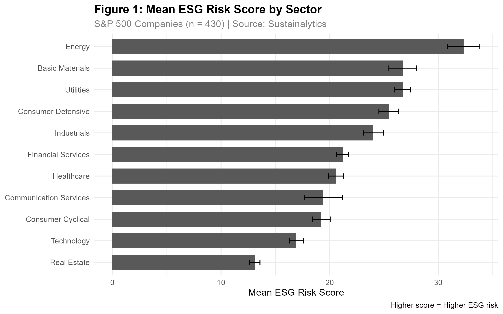
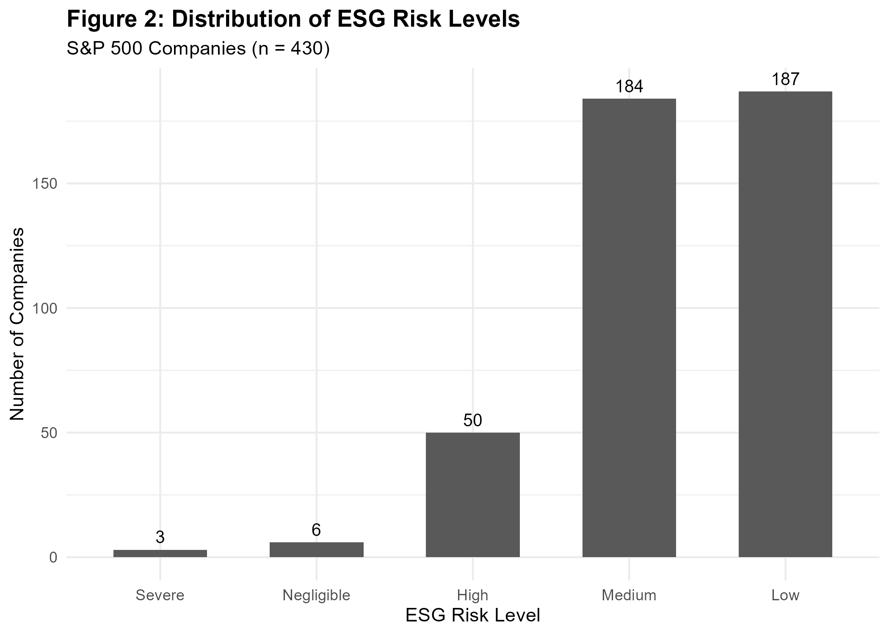
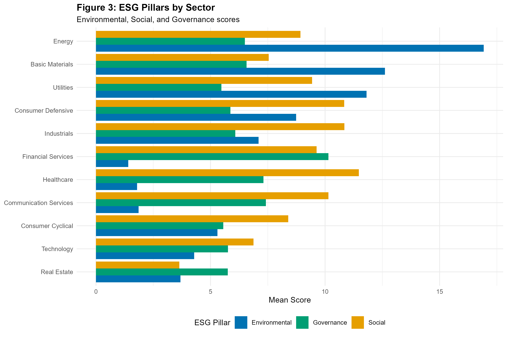

# ESG Risk Analysis of S&P 500 Companies

**Author:** Saman Barati Dastjerdi
**Institution:** University of Hertfordshire
**Date:** May 2025

A self-directed empirical project in R examining whether ESG risk is a sector-level phenomenon or a firm-level one.

---

## Overview

This project analyses ESG (Environmental, Social, and Governance) risk scores across S&P 500 companies using R. It tests two claims: that ESG risk differs systematically across industry sectors, and that larger firms achieve lower ESG risk. The first holds; the second does not.

| | |
|---|---|
| **Data source** | Sustainalytics ESG Risk Ratings (via Kaggle) |
| **Sample** | 430 S&P 500 companies after cleaning |
| **Tools** | R 4.6 · tidyverse · psych · broom · ggplot2 |
| **Methods** | One-way ANOVA · OLS regression with sector controls |

---

## Research questions

1. Do ESG risk scores differ significantly across industry sectors?
2. Does firm size predict ESG risk score after controlling for sector?

---

## Key findings

- ESG scores differ significantly across sectors — **F = 27.98, p < .001**
- Energy has the highest mean ESG risk (**32.3**); Real Estate the lowest (**13.1**)
- Firm size does **not** significantly predict ESG score once sector is controlled — **β = 0.13, p = .566**
- Sector alone explains **40%** of the variance in ESG scores (**R² = .40**)

The null result on firm size is reported as found. A common assumption in ESG commentary is that larger firms, having more compliance resources, carry lower ESG risk. In this sample that relationship disappears once sector is accounted for, which suggests ESG risk is substantially structural rather than managerial.

---

## Figures

### Mean ESG risk score by sector



Bars show sector means with standard error. Higher score = higher ESG risk.

### Distribution of ESG risk levels



### Environmental, Social and Governance pillars by sector



Decomposing the total score shows that the sector ranking is driven largely by the Environmental pillar, while Governance varies far less across sectors.

---

## Project structure

```
esg-firm-performance/
│
├── 01_data_download.R      Retrieve raw ESG ratings
├── 02_data_clean.R         Clean, filter and derive esg_clean.csv
├── 03_analysis.R           Descriptives, one-way ANOVA, OLS regression
├── 04_figures.R            Generate the three figures below
│
├── data/                   Source data (not tracked — see below)
│
├── figures/                Exported PNG figures
│   ├── fig1_esg_by_sector.png
│   ├── fig2_esg_distribution.png
│   └── fig3_pillars_by_sector.png
│
├── results/                Derived result tables
│   ├── table2_sector_esg.csv
│   └── table3_regression.csv
│
├── .gitignore
├── LICENSE
└── README.md
```

Scripts are numbered and intended to be run in order. Each writes its output to disk, so any stage can be re-run independently.

The two tables in `results/` are the derived output of the analysis — sector-level descriptives and the regression estimates — so the figures above can be checked against the underlying numbers without re-running anything.

**A note on the data.** The source ratings are Sustainalytics data obtained via Kaggle and are not redistributed here, since the licence governing them is not mine to extend. The reproduction steps below explain how to obtain them.

---

## How to reproduce

1. Clone the repository.
2. Obtain the Sustainalytics ESG Risk Ratings dataset from Kaggle and place the raw file in `data/raw/`.
3. Create the output directories:

   ```r
   dir.create("data/clean", recursive = TRUE, showWarnings = FALSE)
   dir.create("figures",    recursive = TRUE, showWarnings = FALSE)
   ```

4. Run the scripts in order:

   ```r
   source("01_data_download.R")
   source("02_data_clean.R")
   source("03_analysis.R")
   source("04_figures.R")
   ```

Requires R 4.6 or later and the packages listed above.

---

## Notes and limitations

- ESG ratings are a single provider's construct. Sustainalytics scores are known to correlate imperfectly with other providers, so the sector effect reported here should be read as a finding about this rating methodology rather than about ESG risk in the abstract.
- The sample is cross-sectional. It cannot distinguish a persistent sector effect from a snapshot of one rating cycle.
- Firm size is proxied rather than measured directly, which weakens the test of the second research question.

---

## Licence

MIT — see `LICENSE`.
